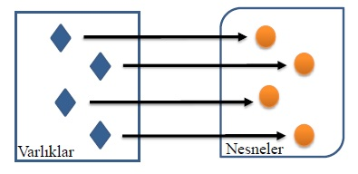

# Decomposition

## Ne?
Decomposition Türkçe ifade ile ayrıştırma, yazılım dünyasında nesne yönelimli tasarım prensibidir.  Çok karışık olan bir sistemi daha iyi anlamak, çözümlemek ve denetlemek için küçük parçalara bölme işlemidir. 

Yukarıda ki görsel de bir sistemin karışık halinin nasıl parçalara ayrıldığı gösterilmektedir. Bu şekilde parçalara ayırma durumuna Decomposition yani Ayrıştırma denir. Ve Decomposition nesne yönelimli tasarımın bir prensibidir.

Son olarak Decomposition için üç tür ilişki vardır:
  
  -	Association
  -	Aggregation
  -	Composition

## Neden?
Decomposition tasarım prensibinin amacı projeler içerisinde, fonksiyonlar içerisinde oluşacak karışıklığın önlenmesidir. Oluşacak karmaşıklığın önlenmesi ise projenin, proje içerisindeki fonksiyonların daha düzenli şekilde bakımının sağlanması, anlaşılır olması ve herhangi bir istenmeyen durumun önüne geçilmesini sağlayacaktır. Dolayısıyla Decomposition tasarım prensibi projelerin sürdürülebilir, anlaşılabilir ve sağlıklı bir şekilde analiz edilmesi açısından önem sarf etmektedir.
Kısacası Decomposition şu yararlarından ötürü kullanılmalıdır:

  -	Yazdığınız kodu yeniden kullanımı daha kolay olması
  -	Yazdığınız kodu test etmek daha kolay
  -	Kodun okuması ve anlaşılması daha kolay
  -	Kod içerisinde hata ayıklamak daha kolay

## Nasıl?
Bir problemin içerisinde birden çok varlık yer alabilir. Birden çok varlığı aynı nesneymiş gibi göstermek yerine her varlığı doğru bir nesne olarak tanımlamak gerekecektir. Her varlığı doğru bir şekilde nesne olarak tanımlamaya böl ve fethet denilmektedir. Her bir varlığı nesne olarak tanımlamak için, “NASIL?” sorusu yerine “NELER?” sorusunu yazılımcı kendisine sormalıdır. Bu sayede problem içerisinde ki varlıkları tespit edebilir ve doğru bir şekilde nesne olarak tanımlayabilir.

#### örnek

printCalendar() metodu, kendi içerisinde iki tane alt metoda bölünmüş durumda. Bunlar readInput() ve printMonth() metotlarıdır. printMonth() metodu da iki tane alt metoda bölünmüş bulunmaktadır. Bunlar printMonthTitle() metodu ve printMonthBody() metotlarıdır. Bu şekilde bir fonksiyon 4 küçük parçaya ayrılarak her metodun bir iş yapmasını sağlamıştır. Bu ayrıştırma işlemine böl ve fethet (divide and conquer) denilmektedir. 
