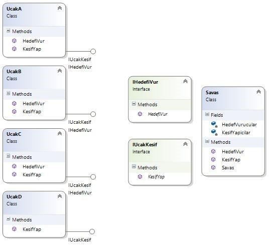

# Liskov Subsitute Principle (LSP)

## Ne?

Liskov Subsitute Princible Türkçe ifade ile Yerine Geçme Prensibi, yazılım dünyasında bir tasarım prensibi olmasının yanı sıra bir SOLID prensibidir. 
Alt sınıfları, türedikleri Üst sınıfın yerine kullanılmasını sağlamaktadır.
Alt sınıflar üst sınıfların tüm özelliklerini ve metotlarını kendi içerisinde barındırmanın yanında, kendine ait özellikleri de barındırmaktadır.
LSP için şu cümle söylenebilir “alt sınıflardan oluşan nesnelerin üst sınıfın nesneleri ile yer değiştirdikleri zaman, aynı davranışı sergilemesini beklemektir.” Barbara Liskov’un ortaya attığı bu prensibe göre üst sınıf ile alt sınıf arasında davranış olarak hiçbir fark olmamalıdır. Yani birbirlerinin yerine kullanılabilmelidirler.

Üst sınıfta yer alan bir fonksiyon alt sınıfta kullanılmayacaksa bu durum LSP’ye aykırı bir durumdur.

## Neden?

## Nasıl?

Bunu bir örnek ile izah etmek istiyorum.

“UcakA”, “UcakB” ve “UcakC” hedefi vurma ve keşif yapma özelliklerine sahip oldukları için iki arayüzden de kalıtım almaktadırlar. “UcakD” ise sadece keşif yapabileceği için sadece “IUcakKesif” arayüzünden kalıtım almaktadır. Bu durumda herşey açık ve nettir. 
“UcakD” sınıfının HedefVurma özelliği olmadığı için IHedefiVur Interfacesini implemente etmemiştir. “UcakD” sınıfı HedefVurma özelliği olmamasına rağmen IHedefVur Interfacesini implemente etseydi ve Override edeceği HedefiVur() metodunu boş bıraksaydı bu durum Liskov Subsitute Princible için ters bir durum olurdu.
